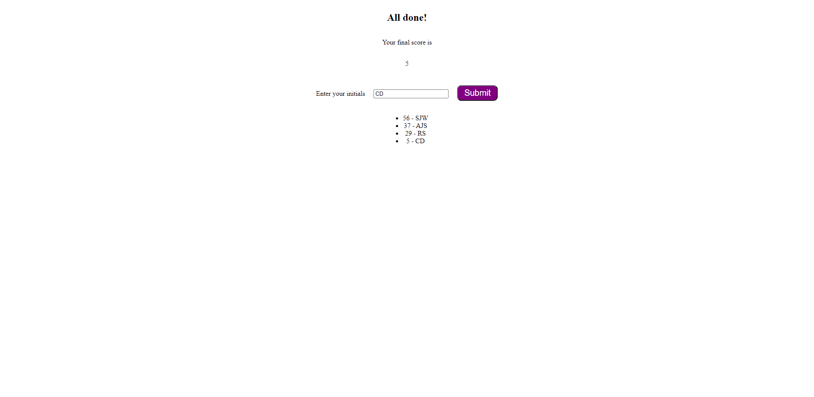

# Decription
This is the finalized JavaScript code quiz website. I worked with two study groups and received assistance from the instructor and a tutor to receive this end product. The user will be able to take a five question quiz based on JavaScript. If they get an answer wrong, the time will be decremented by 10 seconds and move on to the next question. When they finish the quiz, they will be shown their score (the remaining time) and asked to input their initials for local high score storage.

# Deployed Site
Here is the link to the deployed site.

[Deployed Site](https://shrwnwilliams.github.io/random-password-generator/)
